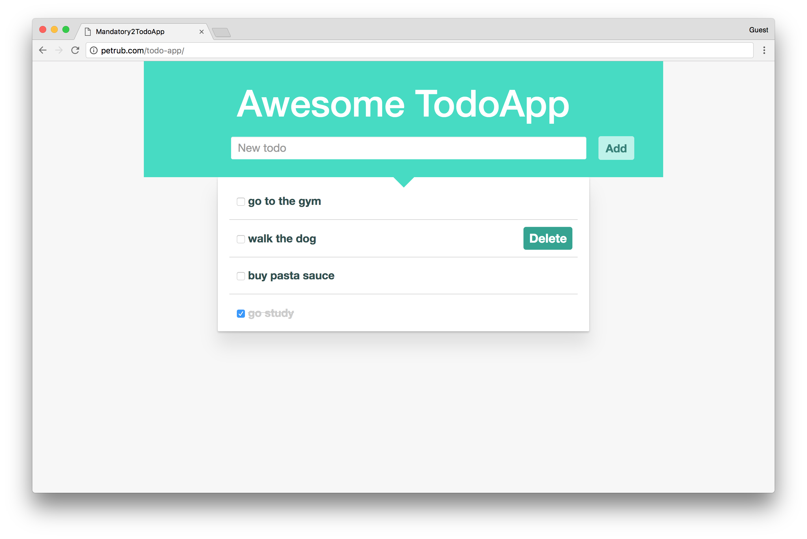

# Mandatory2 TodoApp

> Todo application built using the **MEAN** stack

* Feel free to try the live demo at http://petrub.com/todo-app/

# Features

* Access your todos at any time on the web

* Add todos

* Check todos (mark as done)

* Delete todos

* Pleasant UI/UX built to look awesome from mobile to desktop

# Development

This project was generated with [Angular CLI](https://github.com/angular/angular-cli) version 1.0.1.

Run `ng serve` for a dev server. Navigate to `http://localhost:4200/`. The app will automatically reload if you change any of the source files.

# Technologies

* [Angular](https://angular.io/) - rich frontend web framework, helps creating fast, reliable web applications

  * [Angular-CLI](https://cli.angular.io/) - command line interface for streamlined angular development

  * [TypeScript](https://www.typescriptlang.org/) - superset of JavaScript that can be compiler-checked, also has types!!

* [Bootstrap](http://getbootstrap.com/) - CSS/JS framework, makes it easy to develop responsive, well polished web apps

* [Sass](http://sass-lang.com/) - powerful CSS extension language

# How it works

The application is connected to a node backend. When the app loads, it pull the todos data from the server.

Every time a user performs an action (add, check, delete), it is send to the server and the data gets updated.

The view gets updated as well giving the feel of live editing.

# Motivation

This is a school project, with the purpose of practicing **angular http requests** and **sass styling**.
